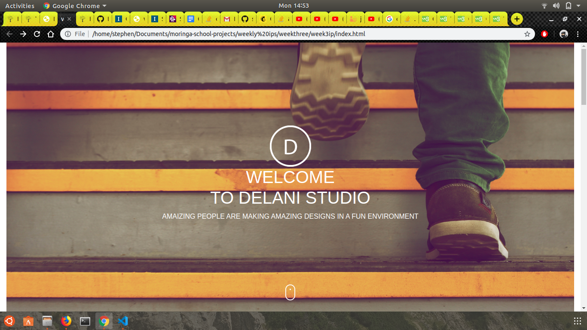
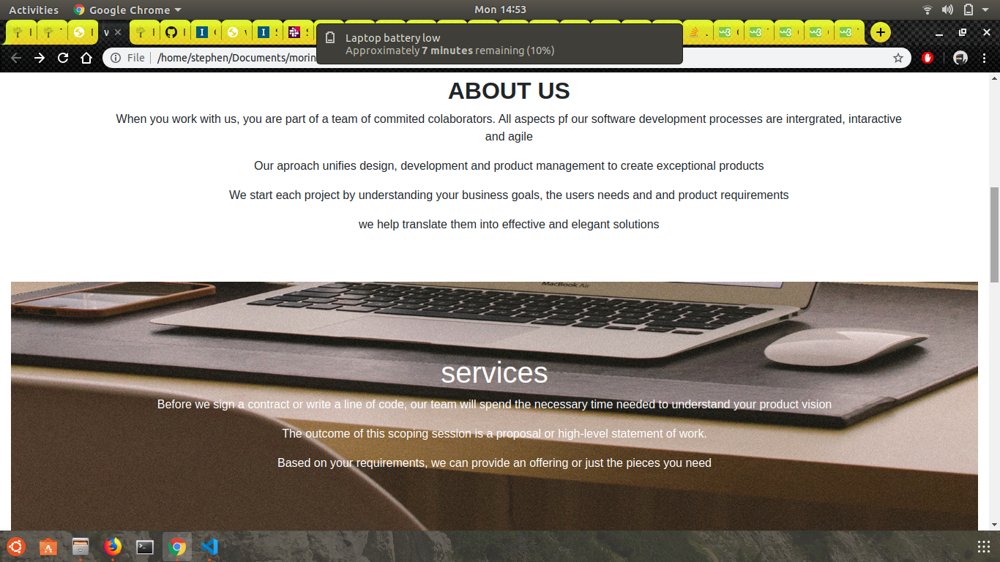
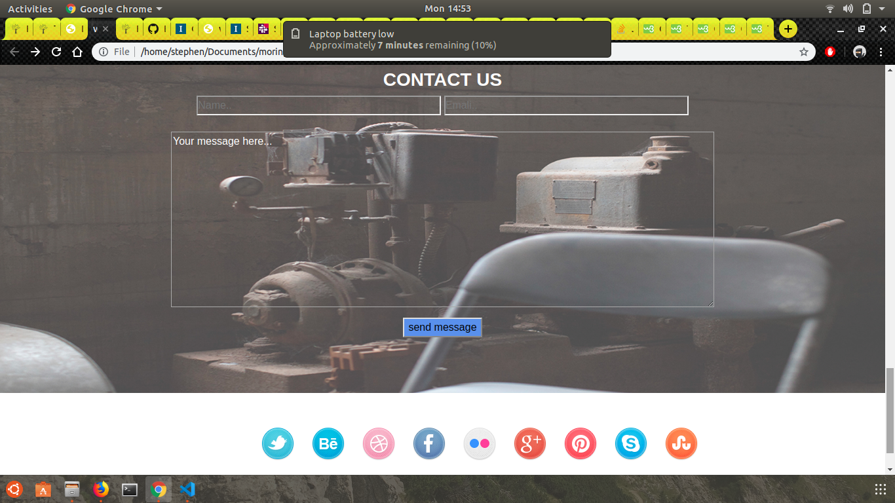

# DELANI STUDIO
#### Brief description of application, current virsion 4-11-2019
This is the landing page of a studio. It is a studion that offers software development in various fields
Its created to create awarness to people of the company's capability
#### By **Stephen Wambua**

# screenshot

This is the first page to the website

This is the area youu find the companies description

This is where a user input their data

## Setup/Installation Requirements
* You need computer or tablet or smart phone to access the site
* Then install a web browser to open the page
* FInaly you can access the page details 
## Known Bugs
There are no known bugs
## Technologies Used
* HTML
* JAVASCRIPT
* JQUERY
* CSS/BOOTSTRAP
## Support and contact details
In case of any issues you can contact me via:
* my email which is ngumbausteph@gmail.com or
* my phone number which is +254718659266
### License
*This is an personal document that cannot be used anywhere else other than by the creater of the site*
Copyright (c) 2019
**{Swiftnet Technologies}**
